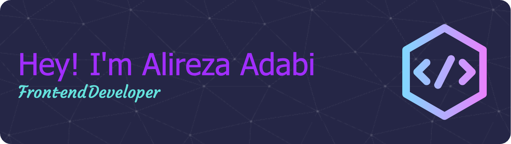

 

<!-- 
 -->

<!--  👋 Hi There, I’m <h2>  Alireza Adabi</h2>
 
 👨‍💻 I’m a Front-end Developer and currently learning React.js, Next.js and other cool thing related to Web Develop. -->

  

  
   

  
<h3>
 💼 Technical Skills
</h3>

   
 <h3>

Contact Me
 
 </h3>

<!---
AlirezaAdabi/AlirezaAdabi is a ✨ special ✨ repository because its `README.md` (this file) appears on your GitHub profile.
You can click the Preview link to take a look at your changes.
--->
